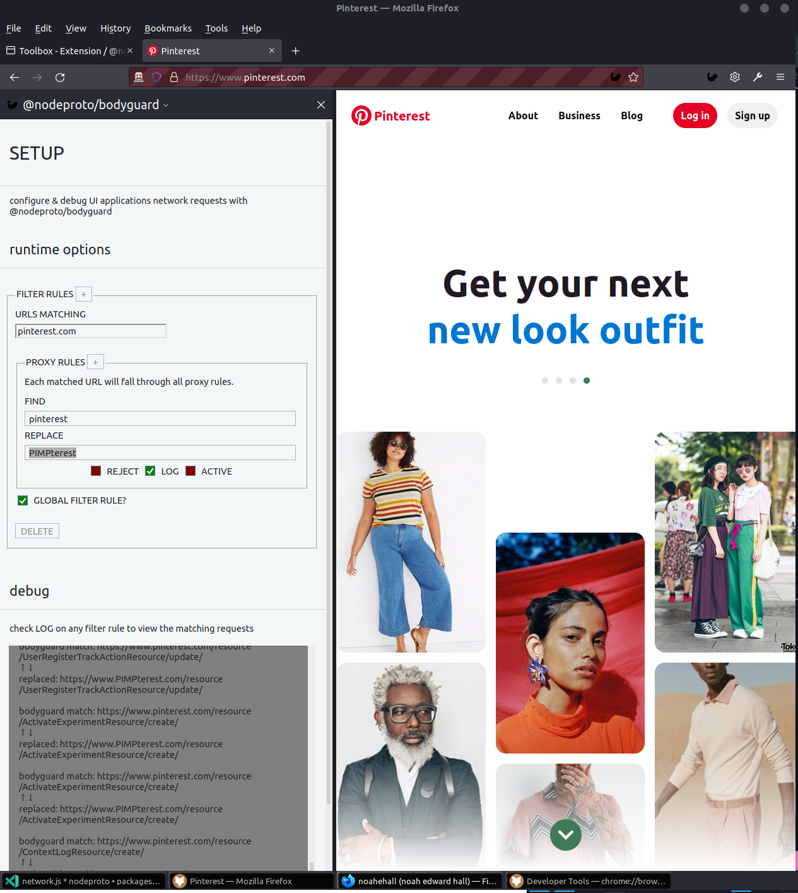

# @nodeproto/bodyguard

- manage UI application network requests with @nodeproto/bodyguard firefox browser extension

## TLDR

- for consumers: manually load `@nodeproto/bodyguard` as a temporary extension into an existing firefox window
  - firefox
    - install via URL: `about:debugging#/runtime/this-firefox`
      - click `load temporary extension` & select `manifest.json`
      - debug via URL: `about:devtools-toolbox?id=noahedwardhall%40gmail.com&type=extension`
  - chromium (edge, opera, chrome)
    - TODO

- for developers: automatically inject `@nodeproto/bodyguard` as a temporary extension into a new firefox window with hot-reloading
  - `pnpm install`
  - `pnpm build` (extract flowtypes & bundle via webpack to /dist)
  - `pnpm webext:run`
    - update `root/config.cjs` to target a browser other than firefox
  - go to `about:debugging#/runtime/this-firefox` and click `inspect` on `@nodeproto/bodyguard`
  - [click the iframe selector](https://developer.mozilla.org/en-US/docs/Tools/Working_with_iframes) to view the dev console of a specific element

# TODO

- [provide linkback for free icon](https://icons8.com/icon/7319/muscle)
- [review how they set this up](https://github.com/ritwickdey/live-server-web-extension/blob/master/manifest.json)
- remove uneeded browser extension icons (browser url, tools menu)
- update context + any menus and remove uneeded options
- only use browser APIs that are cross-browser compatible
- enable use in chromium browsers without modifying config.js

# special thanks to

- [charles web proxy](https://www.charlesproxy.com/)
- [webextensions-examples/menu-demo](https://github.com/mdn/webextensions-examples/tree/master/menu-demo)
- [webextensions-examples/annotate-page](https://github.com/mdn/webextensions-examples/tree/master/annotate-page)
- [webextensions-examples/http-response](https://github.com/mdn/webextensions-examples/tree/master/http-response)
- [webextions-examples/examples.json](https://github.com/mdn/webextensions-examples/blob/master/examples.json)
  - likely the holy grail of copypasta
