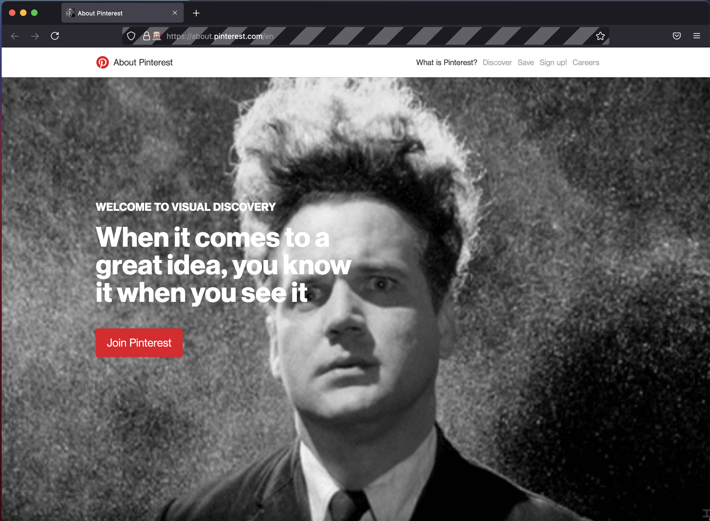

# TLDR

- method A: manually load `@nodeproto/bodyguard` as a temporary extension into and existing firefox window
  - load the manifest.json here: `about:debugging#/runtime/this-firefox`
    - click `load temporary extension` & select `manifest.json`
    - click `inspect` to and view the dev console
      - or load `about:devtools-toolbox?id=noahedwardhall%40gmail.com&type=extension`

- method B: automatically inject `@nodeproto/bodyguard` as a temporary extension into a new firefox window with hot-reloading
  - `pnpm install`
  - `pnpm start`

- see `root/network.js` for network request mgmt
- see `root/screen.js` for DOM mgmt

# TODO

- [provide linkback for free icon](https://icons8.com/icon/7319/muscle)
- [review how they set this up](https://github.com/ritwickdey/live-server-web-extension/blob/master/manifest.json)

# special thanks to

- [webextensions-examples/menu-demo](https://github.com/mdn/webextensions-examples/tree/master/menu-demo)
- [webextensions-examples/annotate-page](https://github.com/mdn/webextensions-examples/tree/master/annotate-page)
